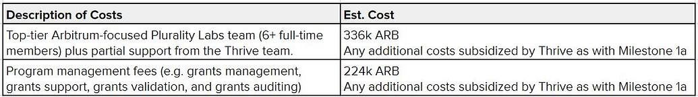

import Features from "@/components/grant-hub/features.astro";
import Banner from "@/components/grant-hub/Banner.astro";
import { titleCva } from "@/lib/cvas";

<Features
  className="!pb-0"
  apply={{
    title: "Who Can Apply?",
    description:
      "The Arbitrum DAO ecosystem encourages innovation and welcomes participation from diverse builders. We are looking for Individuals or groups who can:",

    icons: [
      {
        title:
          "Developers, teams, organizations, and communities, with a focus on those building or contributing to the Arbitrum DAO ecosystem.",
        image: "/images/grant-hub/connect.svg",
      },
      {
        title: "Projects that aligns with the current grant round's priorities",
        image: "/images/grant-hub/data.svg",
      },
    ],

}}
/>

---

### Mission of Thrive Protocol Grant Program Allocator

The mission of the Thrive Protocol Grant Program in Arbitrum is to provide an ecosystem of grant programs that support builders with milestone-based funding for growth. This program, facilitated by Thrive Protocol, aims to distribute 2,600,000 ARB tokens to projects within the Arbitrum ecosystem, focusing on decentralized applications, infrastructure, tools, and various project types. The goal is to foster a pluralist democracy in decision-making processes related to grants, promoting experimentation, decentralization of decisions, and improved resource allocation outcomes within the ecosystem

---

import img from "./assets/value.png";

<Banner
  image={img}
>

### From Milestone 1a to 1b(bridge)

In Milestone 1a, 12 grant programs were funded using diverse decision-making methods to swiftly pinpoint scalable strategies. The newly established Plurality Labs board and community feedback will steer grant allocations in Milestone 1b, identifying areas to expand, refine, or discontinue based on a success rubric. Achievements included the passage of four Firestarters program proposals and the introduction of retroactive grants and quadratic funding via Gitcoin. However, the experience underscored the importance of improved documentation, communication, and the utilization of internal resources. The overarching goal continues to be the creation of a robust, decentralized grants ecosystem for the Arbitrum DAO, with ongoing refinements throughout Milestone 1b.

In the initial proposal, the goal was to demonstrate substantial value creation through a Thrive Protocol grants framework. While the initiative was recognized for its value, feedback indicated a need for enhanced documentation and better preparedness for scaling. Consequently, Milestone 1b is set to maintain the same ARB amount and timeframe with the objectives to:

- Build upon successful grants and discontinue underperforming ones.
- Continue experimentation with grant allocations.
- Fulfill all Milestone 1 deliverables to the satisfaction of the delegates.
- Implement improved technology and systems to facilitate scalability in Milestone 2.
- To meet these goals, Thrive's best practices and delegate feedback will be integrated by:
- Forming a Plurality Labs Board for decentralized oversight.
- Employing the Thrive Protocol for human validations and fund disbursements.
- Strengthening the team with experts in grants, DAOs, and scalability.

</Banner>

---

import img2 from "./assets/team.png";
import Button from "@/components/ui/button.astro";

<Banner
  image={img2}
>

### Advisory Board

Trusted and recognized figures from the Arbitrum community have been assembled to gather community feedback, data, and make strategic decisions regarding grant allocation, specific contributions, and validations. This board represents various stakeholder groups within Arbitrum, and their selection is subject to community ratification, even including members who opposed the Milestone 2 temp check.

This Advisory Board, comprising distinguished members from the Arbitrum community and web3 experts, is dedicated to providing consultation, guidance, and insightful feedback to the Arbitrum grants ecosystem in order to ensure ongoing alignment with community objectives. This board embodies and reflects Arbitrum and Thrive’s commitment to a Thrive Protocol and scalable grants process capable of driving significant value for the benefit of the entire ecosystem.

Moving forward, grants will be disbursed at distinct value creation milestones. White-listed community members from Arbitrum will play a Thrive Protocol role in determining value creation and will be compensated for their contributions. Details on this compensation will be provided later.
In addition to fully leveraging the existing 26-person ThriveCoin team, key additions have been made to the team, including Ben West from GitCoin grants, Kyler Wandler from DAO Research Collective, and Scott Mandel from Complex Labs, Flexa, and 2Q Ventures.

<Button
  arrow
  href="https://forum.arbitrum.foundation/t/thank-arb-oversight-board-charter/23273"
  variant="secondary"
>
  View Charter
</Button>

</Banner>

---

### Costs

As aligned with the feedback we've received from delegates and community members, we made this proposal easy: The total cost and timeframe are the same as the first proposal: 3.36M ARB and 6 months, with 336k ARB to Plurality Labs and 224k ARB to program management, as in the first proposal.

2.8M ARB will be funding ecosystem development, including demonstrating that we can create incrementally more value with our emerging Thrive Protocol grants framework. We are also adding a layer of oversight to our work - welcoming an esteemed Plurality Labs board. They will, among other things, help ensure we deliver the value we promise.

The 560k ARB services fee (same ARB and same buckets as first proposal) includes:

---

### Impact

The intention behind this initiative is to make it one of the most impactful AIPs in Arbitrum's history. If executed successfully, it aims to catalyze sustained, positive ecosystem growth on Arbitrum for years ahead. This will be achieved through a Thrive Protocol grants framework with a strong emphasis on value creation, increased decentralization, and resilience against capture. The goal is to shape the future of Arbitrum.

---
