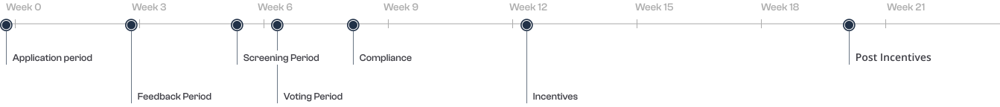

### Timeline

---

### What is LTIPP?

The Arbitrum Long-Term Incentives Pilot Program (LTIPP) is an initiative designed to distribute incentives in ARB tokens to protocols within the Arbitrum ecosystem. This program aims to support and encourage the growth of projects by providing them with financial incentives. The LTIPP has officially started, offering protocols the opportunity to apply for ARB incentives to foster development and innovation within the Arbitrum community. Additionally, updates have been proposed to the LTIPP application template to enhance efficiency and align with new voting processes, ensuring a streamlined application process for interested protocols.

---

### Motivation

#### Testing Incentives Mechanisms For a Long-Term Framework

The Arbitrum DAO has spent the last few months experimenting with incentive programs to attract new users and liquidity to Arbitrum. There is a consensus the DAO will use what we learn from these short-term programs to establish a long-term framework. While STIP V1 brought tons of attention to Arbitrum and has resulted in upticks 1 in protocol metrics, we have learned there were many flaws with the structure of STIP Round 1. This Pilot Program looks to implement new mechanisms to address the issues seen during STIP. The DAO will use this Pilot Program as a test run for a long-term framework before committing to a year-long program.

The Pilot Program will operate using a Council, have Advisors to ensure protocols receive adequate feedback and assistance, and allow protocols more freedom to create innovative ARB incentive plans. We believe these changes will help remedy many of the pain points seen in Round 1. Running the Pilot Program to test these new features will allow the DAO to compare different program methods before implementing a long-term framework beginning in Q2 2024. This will help ensure we have all the knowledge necessary to implement the most effective long-term incentives program for Arbitrum.

#### Why Protocols Need a Round 2

STIP was an experimental program to distribute ARB to protocols to use as incentives for their users. While it was initially intended to have two rounds, the program was substantially more popular than expected, and the entire 50M ARB budget was used in Round 1 and an additional 21.4M ARB was passed through STIP Backfund for teams that were “approved but not funded”.

This meant no funds remained for Round 2, leading to its cancellation. Many protocols either missed the Round 1 deadline, intentionally waited for Round 2 or simply did not know about STIP. This left several protocols with no alternative route to apply for ARB incentives.

Many STIP Round 1 grantees have seen [upticks 1](https://www.openblocklabs.com/app/arbitrum/overview) in their metrics. This Pilot Program would allow protocols that missed out on Round 1 the opportunity to apply to gain these benefits, which will help level the playing field for these protocols. The Pilot Program will replace a round 2 and will be funded with 45M ARB to accommodate the large expected protocol demand we have already seen. This will complete the incentivizing of Arbitrum-based teams to create a holistic competitive edge not against each other but against other chains.

---

import IntroCard from "@/components/grant-hub/Intro-card.astro";
import Button from "@/components/ui/button.astro";

<IntroCard
subtitle=""
title="How to Apply?"

linkCard={{
        title: "Application Template",
        description:
          "The Application Template was created by the LTIPP Council (GFX Labs, 404 DAO, Wintermute, GMX, and Karel Vuong) and the LTIPP Advisors (JoJo, SeedLatam Gov, Castle Capital)",
        image: "/arbitrum.svg",
        url: "https://forum.arbitrum.foundation/t/ltipp-application-template/21292",
      }}

>

1. Create a new forum thread in the [LTIPP section 123](https://forum.arbitrum.foundation/c/dao-grant-programs/long-term-incentives-pilot-program/25) of the forum
2. Title thread [Protocol Name] LTIPP Application Draft
3. Use the [Application template 208](https://forum.arbitrum.foundation/t/ltipp-application-template/21292) to apply
4. Post a completed first draft application by March 3rd, 2024 at 11:59 PM EST
5. After submitting a completed first draft to the forum, Applicants will be assigned an Advisor
6. Applicants will then have until March 17th, 2024 at 11:59 PM EST to work with their advisor and update their application

<Button href="https://forum.arbitrum.foundation/t/ltipp-how-to-apply-faq/21294" variant="secondary" arrow>Learn more</Button>
</IntroCard>

---

### What are the Application Requirements?

The pilot program is for protocols that did not receive ARB during STIP or the Backfund. However, protocols that received grants from the Arbitrum Foundation, Questbook’s grant program, or any other Arbitrum Grants program are eligible to receive Pilot Program funding. Additionally, receiving funding from the Pilot Program does not prohibit protocols from applying for funding from other DAO or foundation programs including the Long Term Incentives Program.

- Grantees must either
  - Be live\* on Arbitrum at the time of the application
  - If available on other chains that are not Arbitrum, be live\* in Arbitrum by the end of the Feedback Period
  - If live only on Arbitrum testnet, be live\* with their product(s)/protocol on Arbitrum mainnet by the end of the Feedback Period
  - Be an Orbit L3 chain that settles on Arbitrum One or Arbitrum Nova
  - Be an Orbit L2 utilizing the Arbitrum tech stack
- Grantees must refrain from farming their own incentive programs.
- Grantees must outline a spending plan, provide a pro forma, and state the grant’s objective.
- Grantees must commit to providing data on distributions, all ARB spending transactions, and key metrics like daily TVL, transactions, volumes, unique addresses, and transaction fees. This data should cover 30 days before, during, and after the Incentivization period, and be presented preferably in a Dune Spell/dashboard.
- Grantees must agree to share all contract addresses being used to distribute incentive rewards.
- Grantees must disclose the contracts being incentivized and denote any external contracts being incentivized as part of the program.
- Grantees can only incentive contracts on the Arbitrum Network.
- Grants are not to be used in DAO governance.
- Grantees are expected to not encourage or partake in Sybil attacks against the forum to sway community opinion.
- Grantees must agree to KYC with the Arbitrum Foundation to receive funds.
- Grantees must apply using the approved program application template.

* “Live” means that either the protocol, the token, or other products are available on the Arbitrum mainnet in a manner that is usable by users, functioning, and have a non-zero amount of Total Value Locked (TVL) or activities. In general, the protocol must be available on the Arbitrum mainnet in such a way that, even if only a subset of core functionalities are available, it can still fulfill the main value accrual proposition for which it was built. The council retains the right to evaluate and, if necessary, veto protocols that do not meet the above criteria from applying to this program.

---
