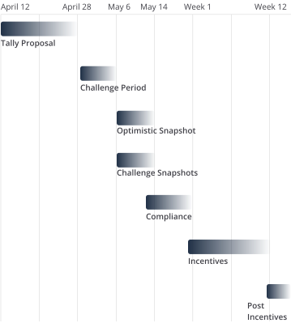

### Timeline

---

### What is STIP Bridge?

The STIP Bridge is an initiative designed to provide interim support and incentives to key protocols within the Arbitrum ecosystem. Its primary aim is to sustain and enhance Arbitrum's market leadership amid intense competition from other Layer 2 solutions. By offering seamless transition incentives, the STIP Bridge ensures the continuous engagement of vital projects until the comprehensive Perpetual Incentives Program is launched. This strategic approach helps retain critical projects and liquidity within Arbitrum, reinforcing the platform's long-term vision of innovation and community empowerment.

---

### Motivation

The Arbitrum ecosystem is currently facing unprecedented competitive pressures, with significant incentive programs launched by rival Layer 2 networks threatening to attract our established protocols away. The STIP Bridge is crucial for retaining these integral projects, ensuring they remain committed to Arbitrum by providing timely, targeted incentives. This initiative is essential to preserve network growth, user engagement, and overall ecosystem stability in a highly dynamic market environment.

---

### Eligibilty

- Any protocol funded under STIP or the Backfund is eligible to apply for a bridge grant coinciding with the LTIPP distribution window.
- This will allow Arbitrum to ensure protocols that had success during the STIP campaign can retain their users and continue to focus on building on Arbitrum.

---

### What Happens During the Challenge and Review Period

- The Challenge and Review Period will run until May 20th, 5:00 PM UTC.
- Delegates will review the addendums to identify applicants they believe need further review before being funded. A full list of addendums can be seen here
  - Delegates should comment as a reply to the addendums stating their intent to post a challenge snapshot and provide reasons why.
- The suggestion is to provide objective reasons, backed by data, on why a protocol participating to the STIP should not receive a STIP bridge funding.
- All late applications will automatically have challenge snapshots posted for them.
- Any challenge snapshot posted must receive at least 66% of the votes in favor of funding (Excluding abstain votes) in order to receive their bridge funding.

---

import IntroCard from "@/components/grant-hub/Intro-card.astro";
import Button from "@/components/ui/button.astro";

<IntroCard
subtitle=""
title="How to Apply?"

linkCard={{
        title: "Application Template",
        description:
          "Any STIP protocol wishing to apply will fill out the Addendum template",
        image: "/arbitrum.svg",
        url: "https://docs.google.com/document/d/1tdpAZAopmragWobcY3MdlROJN0hU3y_cAn0JOkdpsOE/edit?usp=sharing",
      }}

>

1. Any STIP protocol wishing to apply will fill out the Addendum template
2. After filling out the Addendum, protocols will post it in the newly formed “STIP Bridge Addendum” section of the forum. These posts should be titled “[Protocol Name] STIP Addendum”
3. Applicants will be able to meet with an advisor during office hours to get feedback regarding their incentive plan and grant amount as protocols did with LTIPP.
4. Applicants will have around two weeks to submit their Addendums. Beginning when the Tally vote becomes active and ending when the tally vote ends.
5. Applicants can edit their Addendums as many times as they want until the deadline. Once the Tally vote ends Addendums are final and can no longer be modified.

<Button href="https://forum.arbitrum.foundation/t/updates-to-the-stip-bridge-timeline/23723" variant="secondary" arrow>Learn more</Button>
</IntroCard>

---

### Overall Cost:

import InfoCard from "@/components/developer-hub/info-card.astro";

<ul class={"not-prose grid  gap-4 md:grid-cols-2  md:gap-8 lg:gap-6"}>
  {[
    {
      title: "Incentives Budget: 37,500,000 ARB",
      description:
        "To see the estimated distribution of funds for all the STIP Bridge Protocols click here.",
      image: "/images/dollar.svg",
    },
    {
      title: "Operational Cost: 100K ARB",
      description:
        "A maximum of 100K ARB will be used for the operational budget. This could be used to cover the costs of the advisors, pm, multisig signers, additional audits, and or any other expenses that come up while operating the proposal. A separate snapshot will be published to allow the DAO to decide how these funds will be spent.",
      image: "/images/dollar.svg",
    },
  ].map((item) => (
    <InfoCard {...item} normal={true} />
  ))}
</ul>

---
