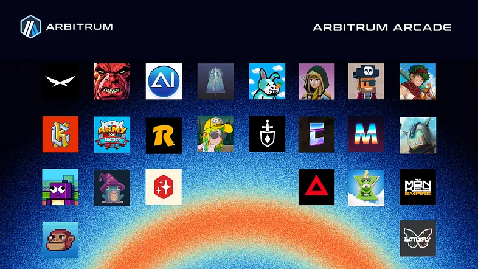

Introducing the Arbitrum Arcade, an Onchain Gameathon designed to showcase Web3's most innovative gaming experiences, provide exposure and prizes to up-and-coming content creators, and bring in-game achievements onchain with [Clique](https://www.clique.tech/), built on top of [EAS](https://attest.org/) (Ethereum Attestation Service).

Arbitrum Arcade will kick off on March 11th through the [Arbitrum Portal](https://portal.arbitrum.io/arcade). Join us for an info session on Tuesday, March 5th, to learn more!

### Prizes and Rewards

As a content creator, you’ll have the chance to have your content featured on the official Arbitrum X account, compete for the chance to win a custom gaming PC, and receive a share of a $200,000 grant prize pool in USD dedicated to creators!

Sign up [here](https://docs.google.com/forms/d/e/1FAIpQLSekWqJTzEmJu-53YNQBXSKnKZg-SMADsrEkCTrErJpZa_mZzg/closedform) between now and March 4th, 12pm EST to be eligible for consideration as an Arbitrum Arcade creator.

As a user you’ll have the opportunity to try out 3+ games every week, use Clique to create attestations about your progress across games, and mint an NFT on [OpenSea](https://opensea.io/) at the end of the campaign signifying your participation.

As a gaming team, deploy your game on Arbitrum One, Nova, or on an Orbit chain by April 15th, and you’ll have the opportunity to join in on the last week of the campaign after applying [here](https://docs.google.com/forms/d/e/1FAIpQLSfDsjGEHwIsAx5Z7eZU5IJzbWHAp1TZ1RFnKWV9zXfuIloFXA/viewform).

Check out all the details about joining the Arcade below!

### Arcade Lineup

Each chapter will last for one week, totaling 8 weeks, featuring a lineup of over 24 games native to the Arbitrum ecosystem and pushing the boundaries of what it means to game onchain.

Ai Arena, Army of Tactics, BattleFly, BattlePlan!, Bitmates, Cosmik Battle, Dininho, Forgotten Runiverse, Kaiju Cards, Knights of the Ether, Kuroro Beasts, Lost Donkeys, Mighty Action Heroes, Minters World, Monkey Empire, Pirate Nation, Realm, SankoGameCorp, Tales of Elleria, The Beacon, Treasure, Xai, Zeeverse, and ZTX are all involved in the first 7 chapters of the Arbitrum Arcade.

Gaming projects not included in the first seven chapters will have the opportunity to join the fun in the last chapter, chapter eight.

If you’re a gaming project and wish to be eligible for consideration in the Arcade, (1) launch your game on Arbitrum Nova or One between now and April 15th, (2) apply to be listed on the Arbitrum Portal, and (3) submit your interest in joining the Arbitrum Arcade [here](https://docs.google.com/forms/d/e/1FAIpQLSfDsjGEHwIsAx5Z7eZU5IJzbWHAp1TZ1RFnKWV9zXfuIloFXA/viewform).

### Creating with Creators

A big part of the Arbitrum Arcade revolves around content creation. To uplift emerging content creators and reward those who generate the most engagement for both themselves and the games, we’ve allocated $200,000 in grants to be equally distributed amongst all creators who participate.

In addition to the $200,000 worth of grants, we’re also giving away 3 fully loaded PCs (up to $5,000 in value) so they’ll never have to worry about bitrate again. 😉

1st PC will go to the creator with the highest amount of referrals

2nd PC will go to the creator with the highest amount of video content produced

- X, Youtube, Twitch, and Sanko TV, Kick, Tik Tok, and Instagram
- MUST include hashtag #ArbitrumArcade across content on all platforms for posts to be eligible-

3rd PC goes to the creator with the highest number of impressions generated through the total content produced

- X, Youtube, Twitch, and Sanko TV, Kick, Tik Tok, and Instagram
- MUST include hashtag #ArbitrumArcade across content on all platforms for posts to be eligible

To be a creator as part of the Arbitrum Arcade, creators must have created at least 10 to 5 forms of web3 gaming video content (shorts or full-length videos) from X, Youtube, Tik Tok, or Twitch within the last 60 days (before 2/27/2024).

To remain eligible for a part of the $200,000 worth of grants and PC giveaway, content creators must produce at least 1 piece of web3 gaming video content per week related to the participating games for that chapter. Winners will be decided following a manual review of content produced during the campaign. Creators can apply [here](https://docs.google.com/forms/d/1LtAw9a_376e_jJFuuOx1oHGIm1mdXcqzsQzVOHh3aB0/closedform).

The Arbitrum Foundation will also join the fun through weekly live streams simulcasted on [X](https://twitter.com/arbitrum) and [Youtube](https://www.youtube.com/@Arbitrum). We’re excited to have some of web3’s most popular content creators streaming with us throughout the Arcade — stay tuned for the names to be announced.

### Onchain Achievements

With the kickoff of the Arbitrum Arcade, we’re introducing an onchain gaming system built by Clique on top of EAS. This system is designed for Arbitrum gamers who want to show off their onchain and offchain achievements across their favorite games within the ecosystem!

EAS on Arbitrum Nova is utilized, allowing open-source contributions from anyone in the community at the infrastructure level. This will live beyond the Arbitrum Arcade, serving as a public good for the Arbitrum community and any gaming community interested in building on top of it for their own gamers.

### Preparing for Arbitrum Arcade

Arbitrum Arcade officially begins on Monday, March 11th! If you’re a user who’s interested in participating, ensure you have ETH to cover gas fees on Arbitrum One and Nova. If you’re a content creator, ensure your camera is ready to go, and your mic’s gain is turned up, and apply to join the Arcade. If you’re a gaming team looking to be part of the campaign, make sure to launch between now and the end of Chapter 4.

GG fam, see you March 11th in the #ArbitrumArcade. 👾
