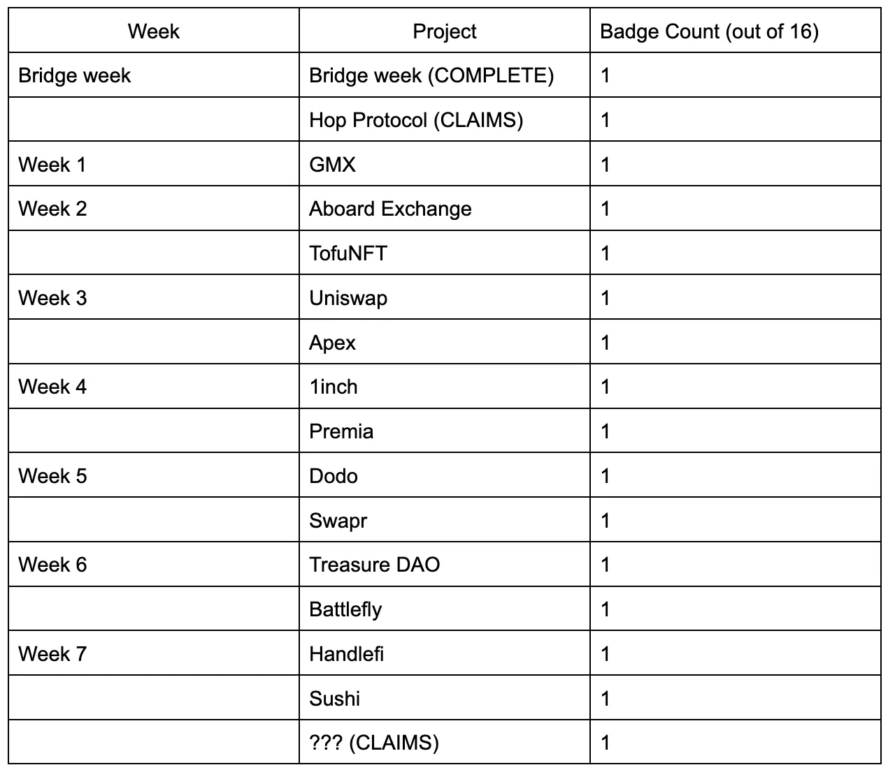

**Tldr**: The Arbitrum Odyssey is back, REIGNITED! In collaboration with [Galxe](https://galxe.com/arbitrum), you’ll go through a 7-week excursion that’ll have you exploring some of the biggest communities in the Arbitrum ecosystem and collect custom badges, created by Ratwell and frens, marking checkpoints throughout your journey.

**Key Takeaways:**

- Arbitrum Odyssey: Reignited starts **September 26th, 2023**. Mission details can be found [here](https://portal.arbitrum.io/missions).
- Hop Protocol is the winning bridge protocol from bridge week!
- The [Arbitrum Portal](https://portal.arbitrum.io/) has been completely overhauled and revamped!
- There will be no airdrop, only the ability to collect badges once completing a mission.
- **FAQ** is located at the bottom of the Odyssey page [here](https://portal.arbitrum.io/missions)

## What is the Arbitrum Odyssey: Reignited?

Starting September 26th, for 7 weeks you’ll be able to explore 13 different projects through completing missions that they assign within the Arbitrum ecosystem. On top of learning more about the ecosystem and the projects within it, you’ll receive custom badges made by Ratwell and frens, members of the community, for completing these missions. A mission could be anything from utilizing a DeFi app, to completing a game!

Each week you’ll find out the missions at hand. In total there are 16 badges that can be collected, 13 badges obtainable after completing each project’s mission, 1 if you participated during bridge week last year, 1 if you bridged using Hop Protocol during bridge week, and 1 final badge if you manage to collect 12 out of those 15 badges. The Arbitrum Odyssey: Reignited will begin on week 1 (see table below), starting with GMX. You can also claim your Hop badge [now](https://galxe.com/arbitrum/campaign/GC5iMU9h5P) if you used it last year during bridge week.

Alongside the re-release of the Arbitrum Odyssey, the [Arbitrum Portal](https://portal.arbitrum.io/) has also received a huge overhaul and will be the home base for all Odyssey related details! See below for the general outline of your journey.

## Let’s bring it back..

The original [Arbitrum Odyssey was announced](https://medium.com/offchainlabs/the-arbitrum-odyssey-87d6e11171d5) one year ago. It was a 2-month long initiative that gave users the ability to experience different Arbitrum ecosystem projects and in return, receive exclusive NFTs designed by Ratwell & Sugoi. 14 projects were voted in by the community on Snapshot to participate. At that time Arbitrum was in its pre-Nitro era, meaning it was running on roughly 1 Ethereum worth of capacity.

Bridge week was a smashing success and ended up with Hop Protocol being the most popular bridge by user count! However when the second week of the Odyssey commenced, congestion rose to levels never seen before due to a combination of the amount of users completing transactions on-chain and the complexity of the smart contracts they were interacting with.

In favor of a better quality of life for the broader ecosystem, the campaign was paused until Arbitrum One went through its Nitro upgrade, giving the chain roughly 7x the capacity of Ethereum.

## So why resume the Arbitrum Odyssey?

In between the pause of the Arbitrum Odyssey and now, there has been an overwhelming amount of awareness and education the campaign brought to new users. In addition, experiencing the Arbitrum ecosystem for the first time. Many had never heard of particular involved projects, and would’ve never even thought to try them out if it wasn’t for this initiative. So while it’s been close to 1 year since the pause of the Odyssey, it’s important to do right by the teams involved, and community members alike. Thus the Arbitrum Odyssey will be reignited.

**There will be no airdrop or reward of any kind**. Badges are the only things users can collect once completing a mission. (and of course the fun along the way 😉).

## What about projects that aren’t part of the Arbitrum Odyssey?

There have been a plethora of new teams and projects that have deployed on Arbitrum One since the beginning of the Odyssey. With that in mind, It’s important to stress that this will not be the last ecosystem-wide initiative that will happen, in fact, quite the contrary!

Additionally, any projects running their own initiatives alongside the Arbitrum Odyssey: Reignited will have the opportunity to have their initiative featured in the [Arbitrum Odyssey portal page!](https://portal.arbitrum.io/missions) Please reach out to the team to have your initiative featured (Your project must be listed on the portal to be considered, submissions are subject to approval).

## What If I completed missions before the Arbitrum Odyssey paused?

If you did participate in the Odyssey before it was paused and..

- Bridged over to Arbitrum One using Hop Protocol during bridge week, then you can claim your badge right now, [here](https://galxe.com/arbitrum/campaign/GC5iMU9h5P).
- If you completed a GMX mission during their week before the pause then you’ll have to complete the new mission when it’s released next week, September 26th, 2023.

## View your badges on OpenSea

Once you’ve completed a mission and claimed your badge, you can view them on your [OpenSea](https://opensea.io/) profile. Here you’ll be able to view and collect all of the badges you acquire throughout your journey on the Arbitrum Odyssey: Reignited!

## WHERE DO I GET STARTED??

For information on the current status of the Arbitrum Odyssey, make sure to visit the Arbitrum Odyssey page on the new and improved Arbitrum Portal!

Information on the missions each week will be updated once the week commences. So make sure to stay tuned on Twitter, Discord, and the [Arbitrum Odyssey page](https://portal.arbitrum.io/missions) on the Arbitrum Portal for all the latest updates.

See you September 26th frens, your journey awaits.
