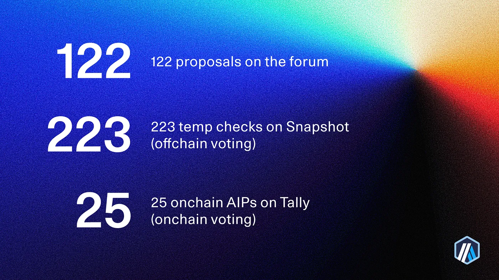
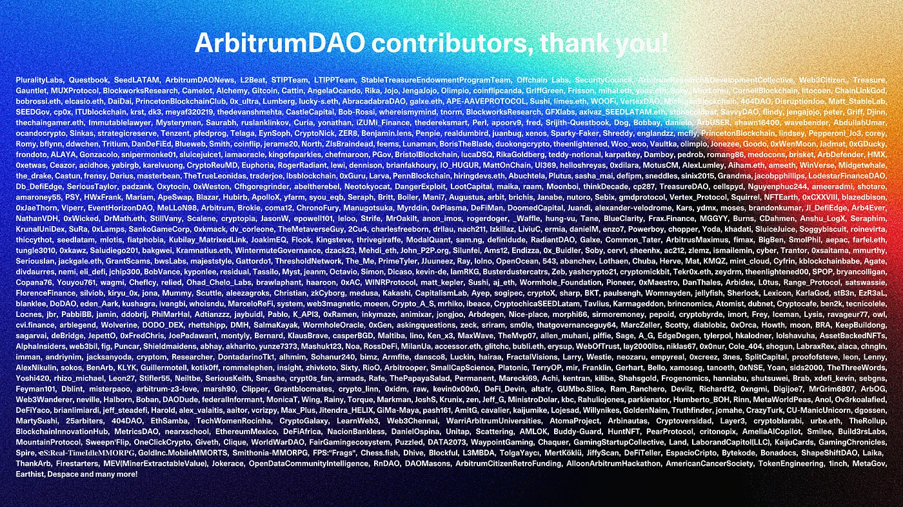
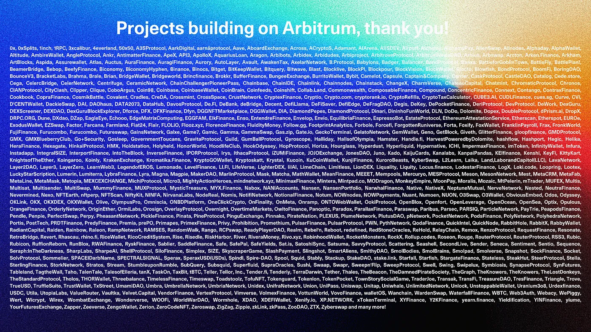
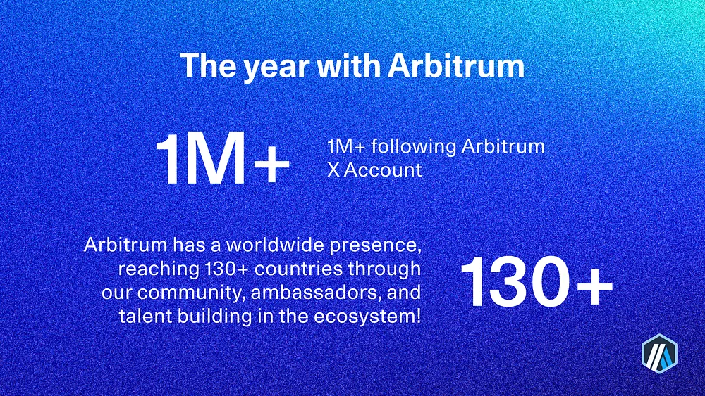
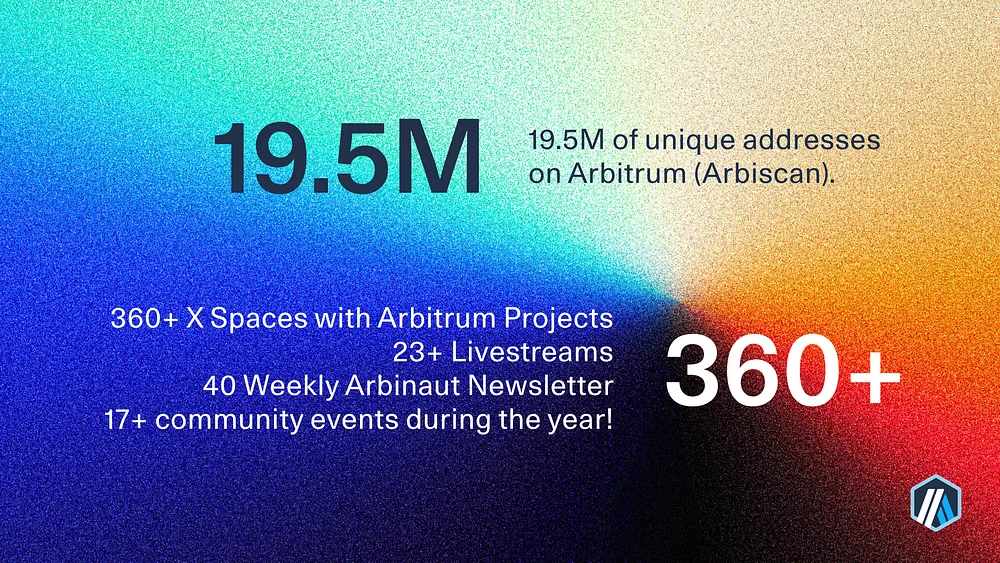
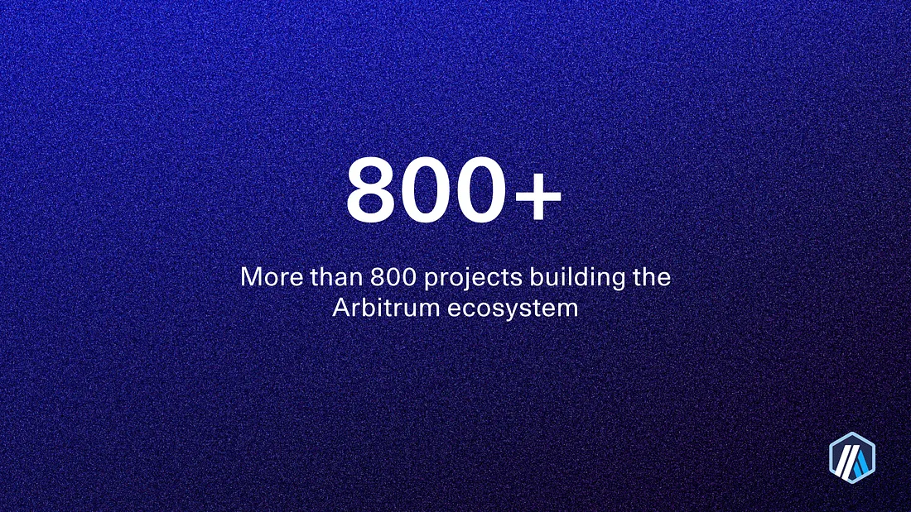
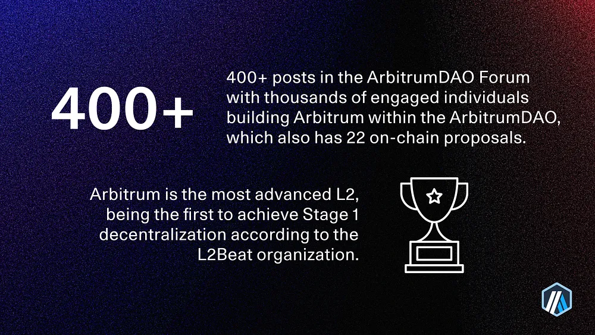

We are thrilled to join our fellow Arbinauts in the ongoing celebrations of Arbitrum DAO’s one year completion. The past 12 months were marked with big wins for the community. Simultaneously, Arbitrum’s technology became more secure and decentralized, supported by the efforts of Arbitrum DAO.

Arbitrum’s technology development started in 2014, and since 2023, the Arbitrum DAO has guided the ownership and governance of Arbitrum One and Arbitrum Nova, allowing the community to shape the future of Arbitrum and Ethereum.

At this point, we extend our gratitude to all the dedicated contributors to The Arbitrum DAO. The Arbitrum DAO was incepted on March 23, 2023, with active community participation kicking off in April 2023. In recognition, we present The Arbitrum DAO: Celebrating The First Anniversary SBT NFT [on NiftyKit](https://twitter.com/sushicreativ), a comprehensive no-code NFT platform for creators and teams to mint, manage, and sell NFT digital collectibles.

The NFT art is a one-of-one open edition created by [Artist Sushi](https://twitter.com/sushicreativ) representing the core values, collaborative nature, and history of Arbitrum, which has been in the making by many since 2014.

> **_NOTE:_** [Mint here💙](https://app.nftkt.io/en/mint/cluvgzhe70001elnn9ezpwvml)

### Recap: A Great Year For Community-Led Governance

The Arbitrum DAO was initiated to foster a more decentralized, secure, and prosperous future for the network. So much has been done in the past year that we would like to share some of the key milestones.

### 🪙 Treasury Spending

The Arbitrum DAO has allocated 750m ARB to the Arbitrum Foundation to carry out its mission statements and additionally, throughout the year it has allocated roughly 175M ARB across grant programs, DAO-led grant programs, and establishing committees like the Arbitrum Research & Development Committee (ARDC) and the Arbitrum DAO Procurement Committee (ADPC).

**🛠 Technical Advancements**

The DAO has approved proposals across 3 critical areas:

1. Activating support for Account Abstraction
2. Improving the Security Council Elections process: The DAO held a round of Security Council elections in September 2023, during which 6 new members for Cohort 1 were elected. Elections for Cohort 2 [are currently ongoing](https://www.tally.xyz/gov/arbitrum/council/security-council/election/1/round-1).
3. ArbOS Upgrades, which support notable Ethereum upgrades like Shanghai and Dencun.

**💙 Meeting-up IRL**

The Arbitrum DAO self-organized their very first meetup with the support of [HackHumanity](https://twitter.com/HackHumanityCo) during [Arbitrum #GovHack](https://twitter.com/arbitrum/status/1765954512060068036) in Denver. Delegates, projects, existing and new contributors hacked on key strategic tracks that the DAO had identified.

During this three-day hackathon, 23 new budding proposals emerged across tracks such as the DAO’s Business Development Strategy, Catalyzing Gaming, exploring backup Sequencers, the DAO’s Orbit Strategy, and the onboarding group.

If this inspires you, you can be part of it too!

Learn how to join the Arbitrum DAO [here](https://arbitrumfoundation.notion.site/Guide-Navigating-the-Arbitrum DAO-adc99590a6f14500bdd73ee38bdbdf46). And/or [apply](https://jobs.arbitrum.io/jobs) to be part of the projects building Arbitrum.

> **_NOTE:_** **Thank you to all Arbitrum DAO Contributors and projects that make Arbitrum special and help the Ethereum and Arbitrum ecosystem grow.**

**🪐 Key Ecosystem Updates:**

- To foster Arbitrum Foundation’s commitment to transparency, the first-of-its-kind [Transparency Report](https://twitter.com/arbitrum/status/1754933172150644738?s=20) was released in February 2024. The report was received with an overwhelmingly positive response.

- Arbitrum One became [the first L2 to surpass Ethereum Mainnet in 24-hour](https://twitter.com/arbitrum/status/1628410398058708992?s=20%E2%80%A6) transaction volume early last year — achieved again multiple times thereafter. With aTVL of 3.15 billion, Arbitrum dominates the [L2 Market Share](https://defillama.com/chains/Rollup).

- [Arbitrum Orbit](https://arbitrum.io/orbit), a permissionless path for launching customizable dedicated chains, is mainnet-ready. Twenty-five publicly announced Orbit chains are already in use like [Rarichain](https://rarichain.org/), [XAI](https://xai.games/), [Sanko](https://twitter.com/SankoGameCorp) and many more are to come, like [Animechain](https://twitter.com/animecoin) by [Azuki](https://twitter.com/azuki), [ApeCoin](https://twitter.com/apecoin) and [Treasure chain!](https://twitter.com/Treasure_DAO)

- New developments in the making that the Arbitrum DAO is yet to vote on:
  — [Arbitrum Stylus](https://arbitrum.io/stylus): An upgrade introducing a new virtual machine to run alongside the EVM. This would enable coding in Rust, C, and C++ while remaining composable with smart contracts.
  — BOLD: The next-gen Fraud Proofs used for permissionless validation and more decentralization and security.
- Arbitrum is the only rollup that sends surplus revenue generated by transaction fees to their respective DAO. To date, the Arbitrum DAO has [12.68K worth](https://www.tally.xyz/gov/arbitrum/treasury) of ETH from sequencer fees as of March 23, 2024.
- Arbitrum is worldwide! The [@arbitrum_cn](https://twitter.com/arbitrum_cn) [@arbitrum_esp](https://twitter.com/arbitrum_esp) [@arbitrum_jpn](https://twitter.com/arbitrum_jpn), [@arbitrum_korea](https://twitter.com/Arbitrum_korea), and [@arbitrum_intern](https://twitter.com/arbitrum_intern) are now active, contributing to a more global vision, a step toward building an Arbitrum that is inclusive and built by and for everyone.
- There were 4 Virtual and IRL events for the community called “ArbitrumDay”. You can find the amazing talks that happened there [here](https://www.youtube.com/@Arbitrum/playlists).
- The Arbitrum Foundation [Grants Program](https://twitter.com/arbitrum/status/1681693961595899909?s=20) has now moved to Phase 3 with multiple Grant Tracks!
- [The Arbitrum Portal](https://portal.arbitrum.io/https:/x.com/arbitrum/status/1704225859882647600?s=20) got a major update, making navigating the Arbitrum ecosystem even easier.
- The Arbitrum Ambassadors Program started this year, and Weekly Newsletters about their achievements are shared every week!

Year 1 has been an absolute blast, and The Arbitrum DAO is poised to be even more active entering year 2. With many more opportunities for new and existing contributors to be involved, it will only get more exciting.

> **_NOTE:_** **Thank you for building a better future for all, with freedom together. To mark this historical moment, grab our first SBT NFT in collaboration with [NiftyKit](https://niftykit.com/) and made by [Artist Sushi.](https://twitter.com/sushicreativ)**

> **_NOTE:_** [Mint here💙](https://app.nftkt.io/en/mint/cluvgzhe70001elnn9ezpwvml)
