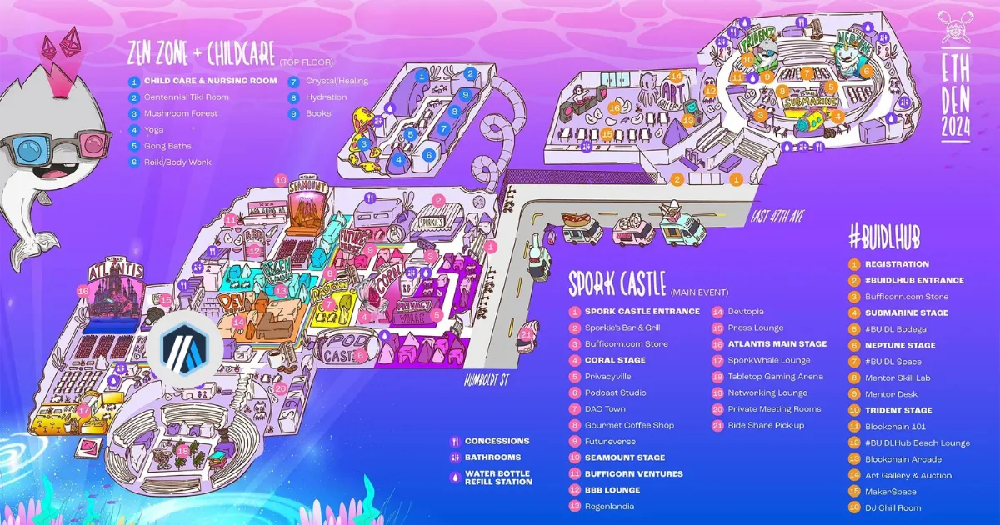
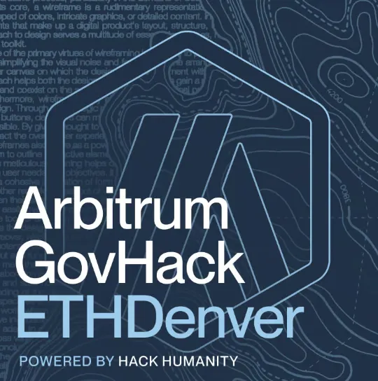

### Denver, here we come!

Arbitrum is heading back to ETH Denver from Friday, February 23rd, to Sunday, March 3rd, and we’re excited to get together to explore, connect, collaborate, and have some fun along the way!

Below, you will find information related to all Arbitrum events and appearances happening throughout the week. If you have any questions or are looking to connect, feel free to jump into our Discord, where we have a dedicated #ETHDenver channel set up.

### ETH Denver #BUIDLathon

This year, Arbitrum is extremely excited to connect with builders on a deeper level at the official ETH Denver #BUIDLathon. #BUIDLers, we have multiple bounties for you to hack on, utilizing Arbitrum’s leading Layer 2 technology.

Be sure to check out our Onchain Chess in Rust With Arbitrum Stylus workshop on February 26 from 5:10 to 5:30 PM on the Submarine Stage. Additionally, we’ll be here to support all #BUIDLers along the way at the Mentor Desk located on the #BUIDLer Floor in the #BUIDLhub and on Discord.

See [HERE](https://www.youtube.com/watch?v=5K1Ap5XC2oY) for a quick video and a roundup of all the bounties available to hack on!

### ETH Denver Booth Location

Arbitrum will be at the Spork Castle (National Western Complex) for the main ETH Denver event! Our booth will be located in the Infrastructure and Scalability track, just before the entrance to the Atlantis Main Stage. Make sure to stop by to chat about Arbitrum and collect some swag 🙂

Check out this map for our exact location.

Booth #229

### Arbitrum GovHack!

We’re excited to present our first-ever in-person GovHack! A 3-day bootcamp for the Arbitrum DAO to come together, make real progress on proposals, ideate as a group IRL, and develop relationships with fellow DAO members.

**February 26th & 27th (Days 1–2) : Governance Bootcamp**

This Hackathon-like experience is set up to make progress on proposals, key ideas, and workstreams by giving builders live access to crucial DAO members with the high context knowledge, relationships, decision-making power, and resources needed.

- Dedicated to DAO contributors
- Representatives from projects on Arbitrum with domain knowledge present to consult with on your idea
- Teams break out, work on proposals and initiatives, and present their findings to all other participants

**February 28th (Day 3): Arbitrum Community Open Day**

It is an opportunity to network with the wider Arbitrum community, which comprises community members, builders, ecosystem projects, and core developers.

- Showcase zone existing projects & grantees share their work
- Open coworking zone
- Lunch + Prize Giving from the Hackathon (Top 3 initiatives pitch)
- Networking & match-making for long-term success, form alliances in the room
- Office hours with delegates and major protocol founders and builders

Register for the event [HERE](https://lu.ma/ArbGovHack)!

### Arbitrum | A Shake Shack Takeover

We’re back at Shake Shack for the second year in a row! Come join Arbitrum at Shake Shack on Friday, March 1st, for a burger (or veg option) on us. Enjoy quality conversations with the Arbitrum ecosystem.

We’ll be at Shake Shack from **12 pm to 8 pm MST**, so feel free to swing by whenever it suits you. We look forward to seeing you there.

**ALSO**, To celebrate this takeover, you can now mint a free generative Arbiburger on [@ProhibitionArt](https://twitter.com/ProhibitionArt), featuring creative work by [@lucastswick](https://twitter.com/lucastswick).

[Mint here!](https://prohibition.art/project/arbiburgers-or-ethdenver)
Register for the event [HERE!](https://lu.ma/Arbiburgers?tk=tiDRoj)
