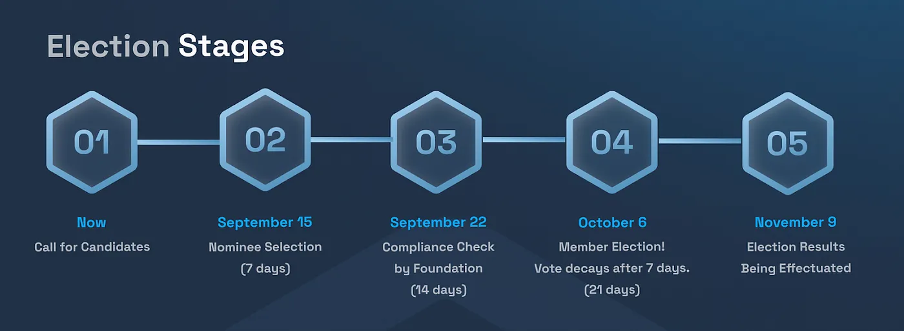
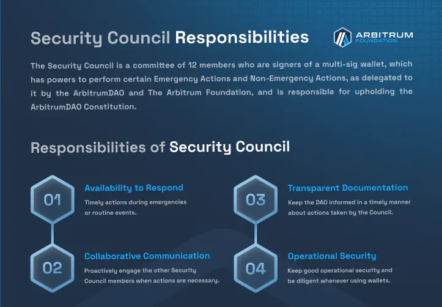
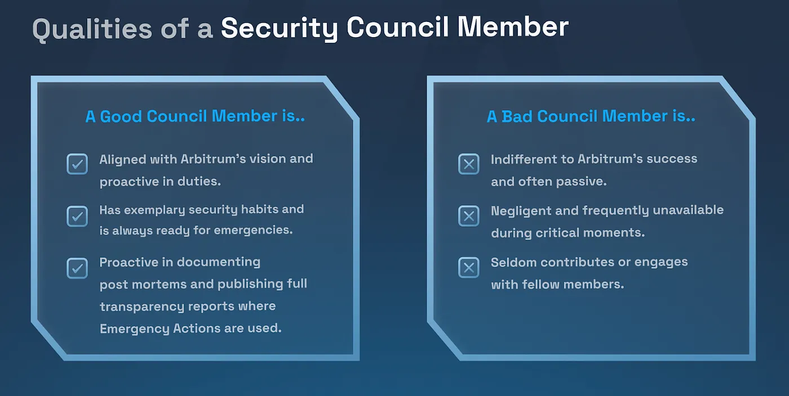
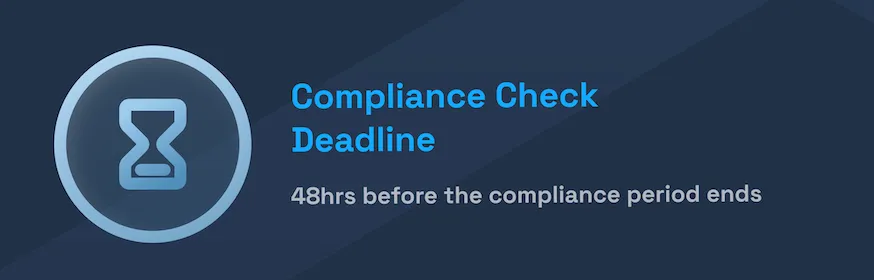
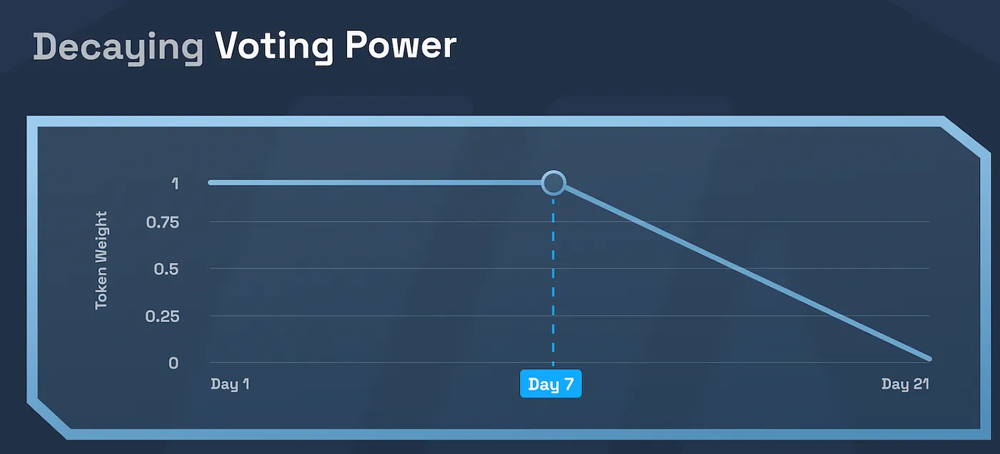

Tldr:

- The Security Council is a vital part of the Arbitrum ecosystem trusted to respond to critical emergencies.
- Security Council Elections are held every 6 months, and allow the DAO to elect new Security Council members.
- Actively participating in Security Council Elections is one of the most important responsibilities of the Arbitrum DAO.

On September 15 2023, the first Arbitrum DAO Security Council Election will take place! Here, we’ll give you the overview of everything you need to know: what the Security Council is, how the Security Council elections work, and how you can participate.

## Background

The DAO-governed Arbitrum chains — like all software — sometimes needs to be upgraded. Arbitrum’s governance system provides two ways for the upgrades to take place: via a DAO proposal, or via the Security Council.

DAO proposals can be submitted by anyone, are transparent, and are deliberately designed to take weeks to finalize. This time allows Arbitrum delegates to vote on the proposal, and ensures that, if the proposal passes, Arbitrum users will still have an opportunity to “opt out” of it by withdrawing their funds before it takes effect.

Some upgrades, however, need to happen quickly — namely, upgrades that fix a critical bug discovered in the system. For this class of upgrades, quick effectuation is necessary to ensure no attacker can exploit the vulnerability once it is public. These fast-upgrades can be carried out by the Security Council.

The Security Council consists of 12 members, any 9 of whose signature is required to authorize an emergency upgrade. The initial Security Council members (i.e., the members prior to the first election on 9/15/23) can be seen [here](https://docs.arbitrum.foundation/foundational-documents/transparency-report-initial-foundation-setup#3-on-chain-dao-governance).

As of this writing, all upgrades have been carried out via the DAO proposal path; no emergency upgrades have been necessary. However, given the known-unknown risk of undiscovered bugs, having an emergency upgrade contingency plan remains vital. The Security Council is trusted to only ever use it’s ability to recover from emergencies; however, technically speaking, the Security Council could upgrade the system arbitrarily. Thus, it is important that the DAO places great importance and deliberation in electing reputable and trustworthy individuals and/or entities to the Security Council.

## Security Council Election: Overview

Security Council elections are a way for the DAO to periodically elect new members (and/or explicitly re-elect members) of the Security Council, ensuring that members remained aligned with the values and best interests of the DAO.

In brief: the 12 members of the Security Council are split into two groups of six, called “cohorts.” Every 6 months, the six seats in one of the cohorts are all up for election, with the target cohort alternating each election cycle. During an election, any party can submit themselves as a candidate in the election. During the election process, the DAO votes on candidates such that ultimately the top 6 are chosen; after a brief grace period, these 6 candidates replace the 6 candidates in the current cohort, finishing the election.

Security Council Election: In Detail
The following is a more detailed overview of the different phases of a Security Council Election:

**Phase 1: Nominee Selection (first voting phase): 7 Days**

During this phase, any party can submit themselves to become a “contender” so long a they are not already a member of the other cohort (the cohort not currently up for election). Also during this phase, delegates can cast votes for contenders. Delegates can split their votes across as many contenders as they please; i.e., if Steve has a total of 1000 delegated votes, he can cast 300 votes for Alice and 700 votes for Bob.

Any contender that receives votes representing 0.2% of all voteable tokens advances to the next phase.

**Phase 2: Compliance Check: 14 Days**

During this phase, as dictated in the Constitution, contenders that pass phase 1 must undergo a compliance check undertaken by the Arbitrum Foundation to ensure they comply with the legal requirements, service agreements, and additional rules dictated by the Constitution. Contenders can start the compliance process by reaching out to “scelection@arbitrum.foundation”. Note that for a contender to be excluded at this phase, the Foundation must take a public, on-chain action.

All contenders that are not excluded during the compliance check are considered “nominees,” and advance to the next phase.

**Phase 3: Member Selection (second voting phase) 21 Days total**

During this phase, delegates voting power is “reset” from phase 1; delegates vote on nominees until 6 are selected as members of the new cohort.

The member selection phase is comprised of two sub-phases: full-weight voting, and decreasing weight voting.

**3a. Full Weight Voting (7 Days)**

During this sub-phase, delegates vote with the full weight of the votes delegated to them.

**3b. Decreasing Weight Voting (14 Days)**

During this sub-phase, delegates voting power decreases linearly; i.e., at the beginning of the sub phase they can vote with 100% of their voting weight, and by the end their votes have 0 weight.

As with phase 1, delegates can split their votes across multiple candidates.

For example: Steve — who, recall, used all 1000 of his votes in phase 1, now, during the full weight voting phase, has 1000 votes once again. Say he casts 600 votes for Bob and 100 for Christine, leaving him with 300 votes left.

Then, he waits until he is 7 days into the decreasing weight voting phase before voting again. At this point he casts all of his votes for Daniel; since he is 50% of the way through this phase, his voting power is decreased by 50%, so Daniel gets 150 votes, and Steve has no more votes to cast.

At the end of the Member selection phase, the six nominees with the most votes are the winners, and are set to become members of the Security Council.

**Phase 4: Grace Period (13 Days)**

This period is simply a delay period after the new members have been officially elected and before they actually become members of the Security Council. This delay period allows Arbitrum users to withdraw their funds if they so chose before the new council members are put into place (as per the constitution), and is also required so that the election results can propagate to the Security Council contracts across all relevant chains.

## How To Participate

The election process is carried on via on-chain smart contracts which can be accessed through the Tally interface [here](https://www.tally.xyz/gov/arbitrum); discussion around elections is encouraged on the [governance forums](https://forum.arbitrum.foundation/).

Here are ways to get involved:

**Potential Contenders**

If you’re interested in putting yourself up for vote to become a member of the Security Council, you are encouraged to carefully review the compliance requirements, risks, and responsibilities involved; for more info, see [here](https://docs.arbitrum.foundation/dao-constitution#section-3-the-security-council)

If you think you’re suited for the job, you can campaign for yourself and engage with the community by posting on the [governance forum](https://forum.arbitrum.foundation/).

**Delegates**

Delegates are encouraged to vote!

Recall that there are two phases during which a delegate can vote; selecting nominees and picking the top six among selected nominees (i.e., phases 1 and 3 above).

Delegates are encouraged to carefully consider the decreasing weight mechanism (3b above) so they can optimize their strategy accordingly.

**Community Members**

All members of the Arbitrum community — whether or not they have delegate votes — are encouraged to participate in elections via public platforms like the [governance forum](https://forum.arbitrum.foundation/) and weigh in on who they think would be strong candidates for security council membership.
